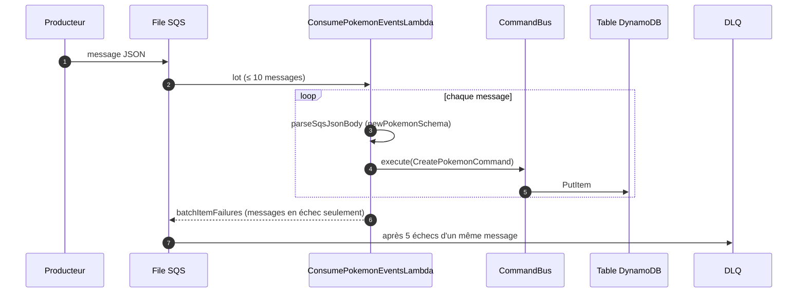

# Consommer les événements pokemon — file SQS

```mermaid
sequenceDiagram
    autonumber
    participant Producer as Producteur
    participant Queue as File SQS
    participant Lambda as ConsumePokemonEventsLambda
    participant Bus as CommandBus
    participant DB as Table DynamoDB
    participant DLQ as DLQ

    Producer->>Queue: message JSON
    Queue->>Lambda: lot (≤ 10 messages)
    loop chaque message
        Lambda->>Lambda: parseSqsJsonBody (newPokemonSchema)
        Lambda->>Bus: execute(CreatePokemonCommand)
        Bus->>DB: PutItem
    end
    Lambda-->>Queue: batchItemFailures (messages en échec seulement)
    Queue->>DLQ: après 5 échecs d'un même message
```
