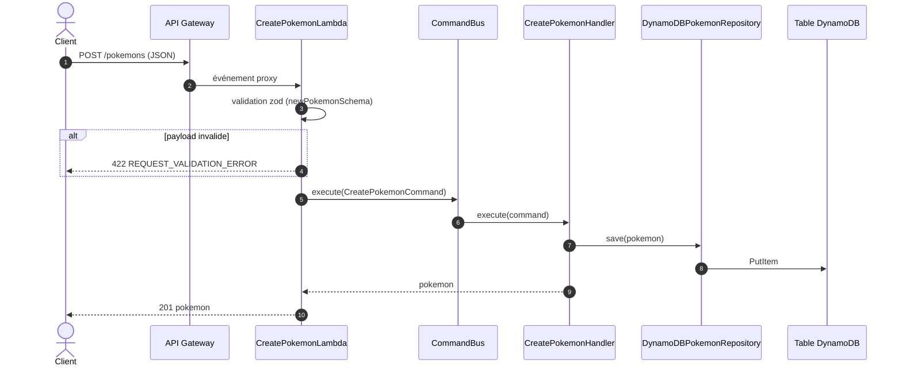

# Créer un pokemon — `POST /pokemons`

```mermaid
sequenceDiagram
    autonumber
    actor Client
    participant API as API Gateway
    participant Lambda as CreatePokemonLambda
    participant Bus as CommandBus
    participant Handler as CreatePokemonHandler
    participant Repo as DynamoDBPokemonRepository
    participant DB as Table DynamoDB

    Client->>API: POST /pokemons (JSON)
    API->>Lambda: événement proxy
    Lambda->>Lambda: validation zod (newPokemonSchema)
    alt payload invalide
        Lambda-->>Client: 422 REQUEST_VALIDATION_ERROR
    end
    Lambda->>Bus: execute(CreatePokemonCommand)
    Bus->>Handler: execute(command)
    Handler->>Repo: save(pokemon)
    Repo->>DB: PutItem
    Handler-->>Lambda: pokemon
    Lambda-->>Client: 201 pokemon
```
