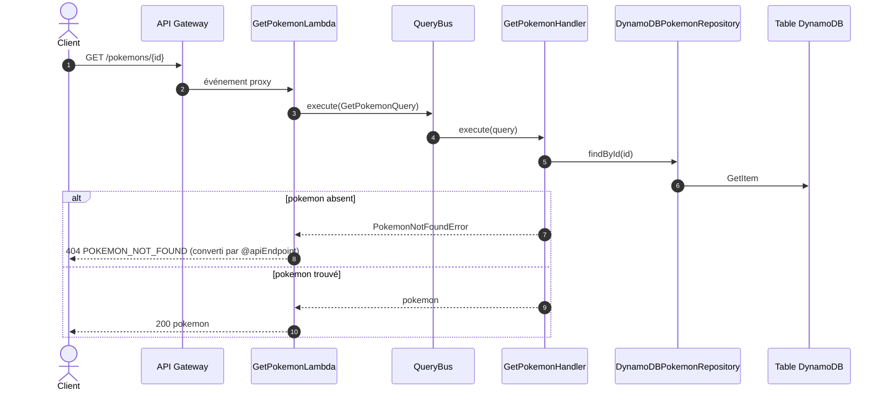

# Lire un pokemon — `GET /pokemons/{id}`

```mermaid
sequenceDiagram
    autonumber
    actor Client
    participant API as API Gateway
    participant Lambda as GetPokemonLambda
    participant Bus as QueryBus
    participant Handler as GetPokemonHandler
    participant Repo as DynamoDBPokemonRepository
    participant DB as Table DynamoDB

    Client->>API: GET /pokemons/{id}
    API->>Lambda: événement proxy
    Lambda->>Bus: execute(GetPokemonQuery)
    Bus->>Handler: execute(query)
    Handler->>Repo: findById(id)
    Repo->>DB: GetItem
    alt pokemon absent
        Handler-->>Lambda: PokemonNotFoundError
        Lambda-->>Client: 404 POKEMON_NOT_FOUND (converti par @apiEndpoint)
    else pokemon trouvé
        Handler-->>Lambda: pokemon
        Lambda-->>Client: 200 pokemon
    end
```
